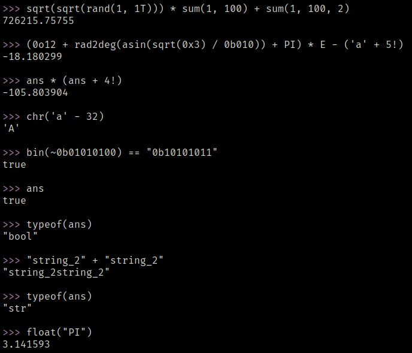

<div align="center">

<h3>ceval in action</h3>

<p>
    <br><br>
</p>

<p><em>Note: Images may be outdated as the project is under continuous development.</em></p>

</div>


<div align="center">

<h1>ceval — C Expression Evaluator</h1>

<pre style="
font-size: 14px;
line-height: 1.1;
user-select: none;
">
     ██████╗         ███████╗██╗   ██╗ █████╗ ██╗     
    ██╔════╝         ██╔════╝██║   ██║██╔══██╗██║     
    ██║      ██████╗ █████╗  ██║   ██║███████║██║     
    ██║      ╚═════╝ ██╔══╝  ╚██╗ ██╔╝██╔══██║██║     
    ╚██████╗         ███████╗ ╚████╔╝ ██║  ██║███████╗
     ╚═════╝         ╚══════╝  ╚═══╝  ╚═╝  ╚═╝╚══════╝
</pre>

<p><em>Lightweight expression evaluator and REPL written in C</em></p>

</div>

**ceval** is a lightweight expression evaluator written in C.  
It works both as an interactive REPL and as a lightweight scripting interpreter, supporting multiple data types, numeric systems, functions, operators and optional math features.

Although simple, it is powerful enough for quick calculations and experimentation. (even helping with math homework)

---

## Purpose

ceval was created mainly for:

- Learning how expression parsers and evaluators work
- Practicing low-level programming in C
- Creating a lightweight alternative to tools like `bc` and `python`
- Experimenting with custom operators and functions

The focus is simplicity, flexibility and educational value.

---

## Features

- Interactive REPL
- File execution via CLI
- File input support
- Optional math library
- String, numeric and boolean operations
- Bitwise and logical operators
- Built-in functions (math, conversion, random, etc.)
- Multiple numeric systems (binary, decimal, hexadecimal and octal)
- Cross-platform support (Linux / MacOS / Windows)

---

## Built With

- **C language**
- **CMake**

---

## Supported Platforms

| Platform |  Architecture  |    Status    |
|----------|----------------|--------------|
| Windows  | x86_64 / arm64 | ✅ Supported |
| Linux    | x86_64 / arm64 | ✅ Supported |
| Android  | arm64          | ✅ Supported |
| MacOS    | x86_64         | ✅ Supported |

---

## Dependencies

To build ceval, you need:

### Required

- **C compiler**
    - GCC or Clang (Linux and MacOS)
    - MinGW / MSYS2 / MSVC (Windows)
- **CMake** (>= 3.10)
- **Git**

### Optional

- **Make** or **Ninja**

---

## Install Instructions

### Android (Termux)
``` bash
apt update
apt install build-essential cmake git
```

---

### Linux (Debian / Ubuntu)

```bash
sudo apt update
sudo apt install build-essential cmake git
```

---

### Windows (PowerShell)

```bash
winget install --id Git.Git -e
winget install --id Kitware.CMake -e
winget install --id MSYS2.MSYS2 -e
```

### MacOS (using brew installer)

```bash
brew install cmake git
```

---

## Build & Run


### Android (Termux)

```bash 
git clone https://github.com/gabk9/C-eval.git
cd C-eval

mkdir build
cd build

cmake ..
cmake --build .

cp ceval /data/data/com.termux/files/usr/bin

ceval
```
---

### Linux and MacOS

```bash
git clone https://github.com/gabk9/C-eval.git
cd C-eval

mkdir build
cd build

cmake ..
cmake --build .

sudo cp ceval /usr/local/bin/

ceval
```

---

### Windows (PowerShell - MSVC)

```bash
git clone https://github.com/gabk9/C-eval.git
cd C-eval

mkdir build
cd build

cmake ..
cmake --build .

$exePath = Get-ChildItem -Recurse -Filter ceval.exe | Select-Object -First 1 -ExpandProperty DirectoryName
setx PATH "$env:Path;$exePath"

ceval
```

---

## Usage

```bash
ceval [OPTIONS...] [FILES...]
<command> <arguments> | ceval [OPTIONS...]

```

### Examples

```bash
ceval script.cev
ceval -l math.cev
ceval file1.cev file2.cev
echo "rand(1, 100)" | ceval -l 
```

---

## Notes

- Some features require `-l` (math library)
- Errors stop execution in file/script mode
